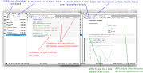

# Notebook Jupyter, l'essentiel ...

* Jupyter est une application permettant de créer et de manipuler des "NoteBook"
* Un "NoteBook" est un document structuré en cellules, affichées les unes sous les autres. Une cellule peut contenir
    1. Du texte mis en forme avec le langage "Markdown", ce texte peut contenir des images, des videos, des symboles et équations mathématiques écrites dans le langage "LaTex".
    2. Un proramme écrit langage "python".
* Une cellule est active, elle peut être éxecutée. Si cette cellule contient du texte formaté, le texte est affiché avec sa mise en forme, si la cellule contient du code, le programme est executé.
 
 Ici les "notebook" sont utilisés pour :
* Vous proposer des corrections d'exercices : ces corrections contiennent en général des bouts de programme en python pour faire les calculs nécessaires. Par défaut, ces notebooks sont accessibles pour visualisation seulement, mais peuvent être exécuter ou téléchargés et déposés sur un serveur ou sur votre machine selon la configuration de l'application Jupyter que vous utiliserez (cf paragrahe "Jupyter l'application ...").
* Vous permettre si vous le souhaitez, de résoudre de nombreux problèmes d'ingénierie, mettre en forme votre démarche et vos résulats dans un "notebook".

*Exemple d'interface d'un notebook Jupyter, ci-dessous celle de Jupyter Lab installé en local :*

*Exemple d'interface d'un notebook Jupyter, ci-dessous celle de colab.research.google.com :*

Vous voulez essayer tout de suite ? vous faire idée sans rien installer, allez ici : https://jupyter.org/try

# Jupyter l'application ...

* Jupyter est une application de type client/serveur.
    * L'interface de l'application s'utilise via un navigateur internet standard (le client)
    * Le serveur (la machine qui réalise les calculs via un noyau "kernel" assurant l'éxecution interactive du code python) peut être une machine distante ou votre propre machine si vous avez intallé l'application en local.
 
 
* L'interface de Jupyter existe aujourd'hui sous deux formes (très proches), la version historique "Jupyter" et une version simplifiée et améliorée "Jupyter Lab".

 Pour en savoir plus sur <a href="https://jupyter.org/about">Jupyter</a>

    
### Jupyter sur un serveur distant

* Sans rien installer sur votre poste vous pouvez utiliser Jupyter avec :
    1. Le serveur mis à disposition de la communauté universitaire par l'université Paris-Saclay, accessible via votre login UTT ici : https://jupytercloud.lal.in2p3.fr.
        * Si vous avez un notebook existant, il faut téléverser  votre notebook sur le serveur (et tous les fichiers annexes) via le bouton "UPLOAD"
        * Si vous souhaitez créer un nouveau notebook cliquer sur le bouton "NEW" puis "Python 3".
     
    2. Via le service gratuit de Google Collaboration : [colab.research.google.com](https://colab.research.google.com/notebooks/intro.ipynb). L'interface est un peu différente, et vous aurez besoin d'un compte Google pour l'utiliser, vos notebook seront sauvés dans le Google Drive de votre compte. La collaboration est possible pour travailler à plusieurs sur un même Notebook.  
    
    3. Les serveurs ouverts et accessibles à tous : https://mybinder.org. Ces serveurs sont configurés à la volée, l'opération peut durer quelques minutes et nécessite que votre notebook soit d'abord déposé sur GitHub. Si vous n'avez pas de notebook sur GitHub, pour en créer un  nouveau cliquez ici : https://jupyter.org/try. Puis "file/New/Notebook", vous pouvez commencer à travailler.

    

### Jupyter sur votre machine

* C'est l'option la plus confortable. Pour télécharger l'application (Windonws, Mac-Os, Linux) rendez vous ici : 

    * https://www.anaconda.com/products/individual (400 Mo de téléchargement, 4Go d'espace disque utilisé).
    
    Choisissez l'installation "graphique" selon votre système, conservez les options par défaut, l'installation ne nécessite aucun droit d'administrateur sur votre machine.
 
    * Cette installation comprend l'application Jupyter et Jupyter Lab et le langage Python accompagné d'un grand nombres de librairies devenues des standards pour le calcul scientifique ([numpy](https://numpy.org),[scipy](https://www.scipy.org)), les représentations graphiques ([matplotlib](https://matplotlib.org)), le traitement des données ([pandas](https://pandas.pydata.org)), le machine learning ([pytorch](https://pandas.pydata.org)), etc ... . Cette application comprend également "[Spyder](https://www.spyder-ide.org)" véritable environnement de développement intégré (type MatLab) pour développer des applications en Python. 

 UTT - Pascal LAFON - Novembre 2020 

